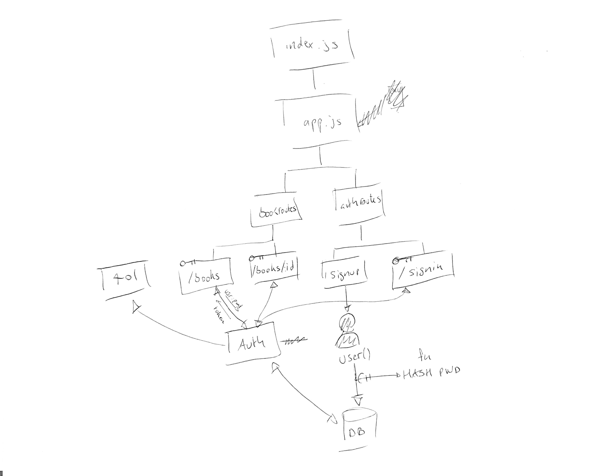

# LAB - 11

## Authentication

### Author: Joé Jemmely

### Links and Resources

- [submission PR](https://github.com/401-advanced-javascript-joejemmely/lab-11/pull/1)
- [travis](https://travis-ci.com/401-advanced-javascript-joejemmely/lab-11)

#### Documentation

- [jsdoc](https://lab-11-jj.herokuapp.com/docs/) (Server assignments)

### Setup

#### `.env` requirements

- `PORT` - Port Number
- `MONGODB_URI` - URL to the running mongo instance/db

#### Running the app

#### Tests

- How do you run tests? `npm test`
- What assertions were made?
  - POST to /signup to create a new user
  - POST to /signin to login as a user (use basic auth)
  - Can't access /books & /books:id without being authenticated

#### UML

